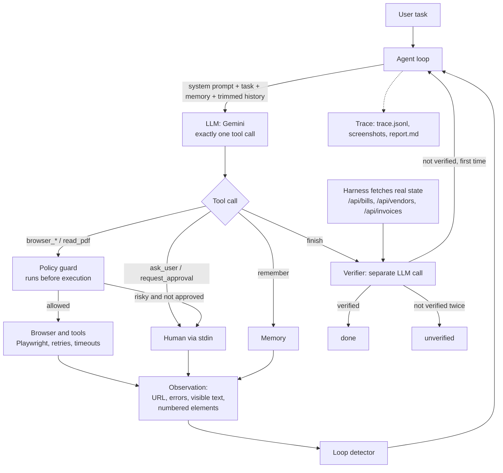

# AI Task Worker

## Overview

AI Task Worker is a prototype agent. You give it a task in plain English, for example "Find the latest invoice from Company X and enter it into the finance system". It then does the task in a real browser (Playwright/Chromium) on a mock company environment. The environment has a vendor portal and an internal finance system.

At each turn, an LLM (Gemini) reads a text version of the page and picks one action. The harness runs that action. It asks a human for approval before risky actions and recovers from errors. When the agent says it is done, the harness checks the real system state itself before it reports success. Every run saves a trace, screenshots and a Markdown report.

## About this submission

I built this prototype for the CentrAlign AI intern task on 3-4 October 2026. I used Claude (chat and Claude Code) heavily. Claude proposed the architecture and wrote most of the code. I worked through the build one stage at a time: I ran each stage, checked the output, fixed problems on my machine (WSL libraries, API key and free-tier quota), and re-ran the tasks before submitting. I am not presenting the design as my own invention. I am going through the code and the design decisions module by module so I can explain, debug and extend the system in the technical discussion.

## Demo

Demo video: <ADD LINK>

An example run (report and screenshots) is committed in [`examples/run_task1/`](examples/run_task1/report.md).

## Quick start

Requires Python 3.11.

Linux / macOS / WSL:

```bash
git clone https://github.com/HetviThakkar-025/AI-Task-Worker.git && cd AI-Task-Worker
python3.11 -m venv .venv && source .venv/bin/activate
pip install -r requirements.txt
playwright install chromium
cp .env.example .env        # then put your GEMINI_API_KEY in .env
```

Windows PowerShell:

```powershell
git clone https://github.com/HetviThakkar-025/AI-Task-Worker.git
cd AI-Task-Worker
py -3.11 -m venv .venv
.venv\Scripts\Activate.ps1
pip install -r requirements.txt
playwright install chromium
copy .env.example .env      # then put your GEMINI_API_KEY in .env
```

**Linux / WSL: Chromium system libraries.** If Chromium fails with `error while loading shared libraries: libnspr4.so` (or `libnss3`, `libasound`), install them once:

```bash
sudo .venv/bin/python -m playwright install-deps chromium
```

Without sudo, download and unpack them locally and point `PW_LIB_PATH` at the folder (`main.py` adds it to `LD_LIBRARY_PATH` before starting the browser):

```bash
mkdir -p ~/.local/share/pw-libs/debs && cd ~/.local/share/pw-libs/debs
apt-get download libnspr4 libnss3 libasound2t64
for f in *.deb; do dpkg-deb -x "$f" ~/.local/share/pw-libs/root; done
# in .env:
# PW_LIB_PATH=/home/<you>/.local/share/pw-libs/root/usr/lib/x86_64-linux-gnu
```

**Run.** The mock app (FastAPI on port 8000) is started automatically if it is not running, and reset before every run.

```bash
python main.py "Find the latest invoice from Company X, extract the amount and due date, enter it into the finance system, and tell me when it is done."
python main.py "..." --headed            # watch the browser (add SLOW_MO_MS=400 for recordings)
pytest                                    # 28 unit tests, no LLM or browser needed
```

To start the mock app manually: `python -m uvicorn mock_env.app:app --port 8000`, then open http://localhost:8000.

## Example tasks

These are results from live runs during development. The main-task and ambiguous-name runs used the final code. The vendor-creation and "enter all / pay oldest" runs happened just before the last two fixes: tolerant JSON parsing in the verifier, and the exact-name prompt rule. Only the `--flaky` and Acme runs used earlier prompt versions (see Known limitations).

| Command | What it shows | Result |
|---|---|---|
| `python main.py "Find the latest invoice from Company X, extract the amount and due date, enter it into the finance system, and tell me when it is done."` | Main task: choose the right vendor and the newest invoice, convert DD/MM/YYYY to YYYY-MM-DD and `4,700.50` to `4700.50` | `done`, verified (10 steps) |
| same task with `--flaky` | First save returns HTTP 503; agent re-enters the form and retries | `done`, verified, no duplicate bill |
| `python main.py "Find the latest invoice from Acme Supplies, enter it into the finance system, and tell me when it is done."` | Amount 124,050 is above the approval threshold. Answer `n`: agent stops with `failed`, nothing saved. Answer `y`: bill saved | `failed` / `done` |
| `python main.py "Find the latest invoice from Company and enter it into the finance system."` | Ambiguous name ("Company X" vs "Company X Ltd"): agent asks the user | asks, then `done` after answer "Company X" (re-run with the final code and prompts, 15 steps) |
| `python main.py "Create a new vendor called Globex Corp in the finance system."` | Different workflow, no code changes | `done`, verified (7 steps) |
| `python main.py "Enter all invoices from Company X Ltd into the finance system, then mark the oldest one as paid."` | Multi-record task plus an irreversible action ("Mark as paid" requires approval) | `done`, verified (26 steps) |

Flags: `--headed`, `--flaky` (inject one 503 on save), `--auto-approve` (tests only, prints a warning), `--no-reset`, `--max-steps N`.

## Architecture



| Module | Responsibility |
|---|---|
| `main.py` | CLI, env setup, starts and resets the mock app, runs the agent, writes the report |
| `agent/loop.py` | The agent loop, system prompt, history trimming, approval flow, finish and verification handling |
| `agent/llm.py` | The only provider-specific file: Gemini calls, message conversion, backoff, model fallback chain |
| `agent/browser.py` | Playwright session; turns a page into text state with numbered elements; click, type, select |
| `agent/tools.py` | Tool schemas and dispatcher; tool errors become `ERROR: ...` observations |
| `agent/policy.py` | Task-agnostic approval rules based on visible labels and values |
| `agent/approval.py` | Human approval prompt (y/N), `AUTO_APPROVE` for tests |
| `agent/verifier.py` | Snapshot of the real system state and an independent LLM audit of the outcome |
| `agent/reliability.py` | Loop detection, retry of transient browser errors, tool timeout |
| `agent/memory.py` | Key-value working memory, re-injected into every prompt |
| `agent/trace.py` | Per-run directory with JSONL trace, screenshots and `report.md` |
| `mock_env/` | FastAPI + Jinja2 vendor portal and finance system with deliberate traps |

## Key design decisions

- **Text page state instead of screenshots.** The model does not see screenshots. The browser layer gives it the URL, the title, visible errors, a short text version of the page (table rows kept as `a | b | c`) and a numbered list of interactive elements. The numbers are written into the DOM (`data-agent-id`), so each action points at exactly one element. This is cheap, deterministic and easy to debug from logs. The downside is that it fails on canvas-heavy or visually encoded pages.
- **One tool call per turn.** Function calling is forced (`mode=ANY`). Every action returns the fresh page state. So the model always decides from what actually happened, and never from a plan it wrote several steps earlier.
- **Errors are observations.** Tool failures, app validation errors and denials come back to the model as text, for example `ERROR: Element 12 not found; call get_state, ids change after navigation`. The model can read them and try something else. A bad action never crashes the loop.
- **The harness does the verification.** When the agent calls `finish`, the harness fetches `/api/bills`, `/api/vendors` and `/api/invoices` itself. The agent cannot change this snapshot. A separate verifier prompt then compares every value with the source data. If verification fails, the agent gets it back once. If it fails a second time, the run ends as `unverified`.
- **Task-agnostic approval check before execution.** `policy.check` runs before every browser action. It asks for approval on clicks whose label means payment, deletion, cancellation or sending. It also asks for approval on Save/Submit/Create when an amount field is at or above `APPROVAL_THRESHOLD`. The model can call `request_approval` itself too. A granted approval covers the next guarded action. After a denial, the human is not asked again for the same task.
- **Provider-neutral messages and a fallback chain.** The loop uses a simple message format: `{role, content, tool_name, tool_args, meta}`. Only `llm.py` knows about Gemini. The `meta` field carries Gemini 3 thought signatures back unchanged. When quota runs out or there are repeated 503s, `llm.py` moves to the next model in `GEMINI_FALLBACK_MODELS` and prints that it did so. If the server suggests a wait longer than 90s, it does not sleep through it.
- **History trimming plus memory.** The last 6 tool results stay in full. Older ones are cut to 300 characters. Facts the agent saved with `remember` are added back into every turn, so trimming does not lose them.
- **Reliability.** Transient browser errors (timeouts, `net::ERR`, navigation failures) are retried with backoff. Validation errors are not retried. A loop detector warns on 3 identical actions or on A-B-A-B-A-B alternation. 3 warnings in a row stop the run.
- **Deliberate traps in the mock environment.** Each trap tests one capability:

| Trap | Tests |
|---|---|
| Invoice list not sorted by date (newest Company X invoice is in the middle) | Comparing dates instead of taking the first row |
| "Company X Ltd" has a more recent invoice than "Company X" | Entity disambiguation |
| Portal shows dates as DD/MM/YYYY, finance form requires YYYY-MM-DD | Format conversion; the form rejects wrong dates with a visible error |
| Amounts shown as `4,700.50`, finance field is `type=number` | Number normalisation |
| Issue date and due date both on the invoice | Using the field the task asks for |
| First invoice-list request after reset takes 2 seconds | Waiting for slow pages |
| Duplicate invoice numbers rejected ("Duplicate bill") | Not creating duplicates on retry |
| Acme invoice over 100,000 | Approval policy |
| `--flaky`: first valid save returns 503 without saving | Recovery from transient server errors |
| Invoice also available as PDF | `read_pdf` tool |

## Models, APIs, frameworks and components used

- **LLM:** Google Gemini via the `google-genai` SDK (Google AI Studio free tier). Runs used `gemini-3.5-flash`, `gemini-3.6-flash`, `gemini-3-flash-preview` and `gemini-3.5-flash-lite`, depending on quota.
- **Browser automation:** Playwright (sync API, Chromium headless shell).
- **Mock environment:** FastAPI, Jinja2, Uvicorn, python-multipart, reportlab (PDF generation).
- **Other:** pypdf (PDF text extraction), httpx, python-dotenv, pytest.
- No agent framework (LangChain etc.) is used; the loop, tools, policy and verifier are written from scratch.
- Built with the help of AI coding tools (Claude Code).

## Assumptions

- The worker uses websites the way a person would, through the UI. The `/api/*` endpoints are read-only ground truth. Only the verifier and the harness use them. The agent never does.
- "Latest" means the most recent issue date. A bill counts as "entered" when it exists in the finance system with the correct vendor, invoice number, amount and due date.
- Payments, deletions, sends and high-value submissions are irreversible enough to need a human. Normal form saves below the threshold are not.
- A human operator is at the terminal for questions and approvals. If there is no input (EOF), approvals count as denied, and a question ends the run with status `asked_user`.
- One task per run. State does not carry over between runs.
- The base URL and starting paths are environment configuration (`START_PATHS` in `.env`), not task logic.

## Evaluation mapping

| Criterion | Where it is implemented |
|---|---|
| Autonomy | `agent/loop.py`: the model plans each step from the page state; the task only states the goal. Generic prompt rules: compare dates, convert formats, ask only when ambiguous |
| Execution | `agent/browser.py`, `agent/tools.py`: real Chromium actions against a running web app; results visible in `/api/bills` |
| Reliability | `agent/reliability.py` (retries, timeout, loop detection and hard stop), `agent/llm.py` (backoff, fallback chain), errors as observations, `--flaky` run |
| Verification | `agent/verifier.py` plus `Agent.on_finish`: harness-fetched state, independent audit prompt, one retry, then `unverified` |
| Generalization | Same code ran vendor creation and "enter all and pay oldest" with no changes to `agent/`; no task-specific logic in `agent/` |
| Engineering quality | Small modules with one job each, provider isolated in `llm.py`, 28 unit tests with fake LLM and fake session, per-run traces |
| Product thinking | Asks only when genuinely ambiguous, approval for irreversible or high-value actions, concise summary with evidence, `report.md` for audit |
| Technical understanding | This README; trace and report make every decision inspectable (`runs/<timestamp>/trace.jsonl`) |

## Known limitations

- **Same-model verifier.** The verifier is a separate prompt, but it uses the same model family as the worker. So it can have the same blind spots. Its judgement is based on data the harness fetched, but it is still an LLM judgement.
- **Timeout is not a hard kill.** The 15s tool timeout relies on Playwright's per-operation timeouts, and retries stop after 15s. With the sync API, a stuck call cannot be interrupted from outside.
- **Free-tier quota.** The Gemini free tier allows about 20 requests per day per model. One run uses 10 to 26 requests. So live testing needed several models and the fallback chain. Some runs used a lite model.
- **Single mock environment.** Only one small site has been tested. It has no login, captcha, file upload, iframe, pop-up window or multi-tab flow.
- **No long-term memory.** Memory only lasts for one run.
- **Prompts changed during development.** Some earlier runs (the `--flaky` and approval scenarios) used earlier versions of the system prompt. The prompt was made stricter later (approval threshold in the prompt, no approval requests for routine actions, exact-name matching). Not all of those scenarios were re-run with the final wording.
- **Few tasks tested.** About eight different live scenarios. There is no success-rate measurement over repeated runs.
- **Gemini 3 thought signatures** are handled only in `llm.py`. A different provider would need its own adapter. The rest of the code would not change.
- **Approval rules are based on labels.** If a button has an unclear label (for example "Confirm" that actually pays), the policy would not catch it unless the model asks for approval itself.
- **Noisy screenshot trigger.** The "left a form" trigger also fires on pages that only have a search box.
- **Tested on WSL (Ubuntu) only.** The Windows PowerShell and macOS setup steps are written but not tested.

## Issues found during testing

- **Verifier rejected a correct result.** The verifier model replied `"verified": true`, but it put a raw newline inside a JSON string. Strict parsing failed, so the run was marked unverified. Fix: tolerant JSON parsing, plus a regression test.
- **Agent asked about an exact match.** A prompt rule about ambiguity made the agent call `ask_user` even when the vendor name matched exactly. Fix: the rule was rewritten. Exact matches are now used directly, and only partial matches trigger `ask_user`.
- **Approval asked again after a denial.** After the operator denied an action, the agent asked for approval again. Fix: further approval requests in the same task are now refused without asking the operator.
- **Loop warnings ignored.** The agent got 10 loop warnings in a row and kept going. Fix: the run now stops after 3 warnings in a row.
- **Quota ran out mid-testing.** The Gemini free-tier daily quota ran out during testing. The retry delay the server suggested would have slept for hours. Fix: a 90s cap on retry waits, and a model fallback chain (`GEMINI_FALLBACK_MODELS`).
- **Gemini 3 thought signatures.** Gemini 3 models need thought signatures from earlier turns to be passed back. They are carried in an opaque `meta` field on each message and handled only in `llm.py`.

## What I would build next

1. **Evaluation suite:** scripted scenarios (traps, chaos, approvals, ambiguity), each run N times. Track success rate, steps, cost and verifier agreement for every commit.
2. **Independent verifier:** use a different model or vendor for verification. Add deterministic checks where the expected state can be computed.
3. **Resumable runs:** save checkpoints of memory, history and browser state, so a run can pause for approval and continue later.
4. **Richer permissions:** per-tool and per-site policies, allow/deny lists, budget limits, and approval through Slack or email instead of stdin.
5. **DOM and vision hybrid:** fall back to screenshots and coordinates on pages that the text state cannot show.
6. **Long-term memory:** remember facts about each site (where things are, required formats) and reuse them across runs.
7. **Parallel workers** with a task queue, and real integrations (email, ERP APIs) behind the same tool interface.

## Safety note

The agent only operated the local mock environment in this repository. No real company systems, credentials or confidential data were used. `.env` (API key) is git-ignored; `.env.example` contains placeholders only.
